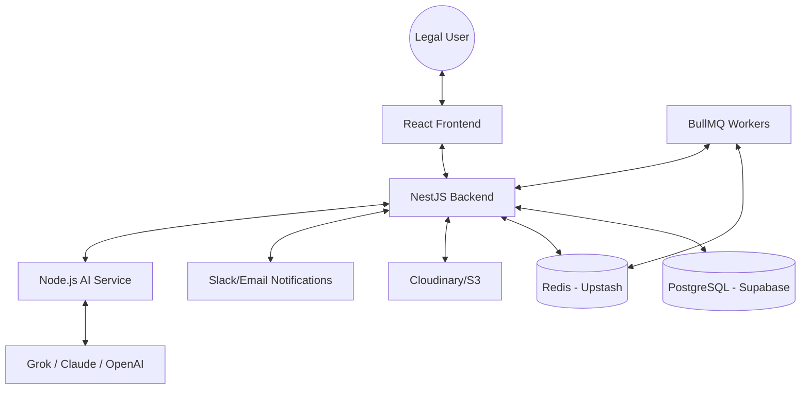

# ⚖️ LegalPulse

**LegalPulse** is an enterprise-grade, AI-powered legal operations platform designed to streamline document management, contract analysis, and matter tracking. It leverages Claude 3.5 Sonnet and Grok (xAI) to provide human-level understanding of complex legal documents, enabling legal teams to work with unprecedented speed and accuracy.

## 🏗️ Architecture Overview



## 🌟 Key Features & Capabilities

### 1. Intelligent Contract Lifecycle
- **Automated Extraction**: Pulls 15+ critical data points (Effective Date, Termination, Liability Caps, Governing Law) using a dedicated AI extraction engine.
- **Confidence Scoring**: Every AI-extracted field includes a confidence score, highlighting items that require human verification.
- **Split-Pane Viewer**: Compare extracted terms side-by-side with the original document in a high-fidelity PDF viewer.

### 2. Proactive Risk Management
- **Smart Alerts**: Multi-channel notifications (Slack, Email, In-app) for upcoming expiration dates and auto-renewal deadlines.
- **Dynamic Dashboard**: Real-time visualization of portfolio health, active alerts, and matter statuses.

### 3. Matter & Collaboration
- **Centralized Matter Log**: Track litigation, IP filings, and corporate governance matters.
- **Role-Based Access Control (RBAC)**: Secure multi-tenant architecture ensuring data isolation between organizations.

### 4. Advanced AI Search
- **Semantic Search**: Use natural language to find clauses (e.g., "Find all contracts with 30-day termination for convenience").
- **Hybrid Vector Search**: Powered by pgvector and AI embeddings for 99% retrieval accuracy.

## 📁 Repository Structure

```bash
LegalPulse/
├── client/           # React 19 + Vite + Tailwind CSS 4
│   ├── src/pages/    # Dynamic Dashboard, Contracts, Matters, etc.
│   └── src/lib/      # API clients and auth utilities
├── server/           # NestJS + TypeORM + PostgreSQL
│   ├── src/modules/  # Feature modules (Stats, Contracts, Matters, etc.)
│   └── src/common/   # Shared services (Mail, Slack, Cloudinary)
├── ai/               # Standalone AI Service (Node.js + TypeScript)
│   ├── src/index.ts  # Extraction (Grok) & Embeddings (OpenAI) logic
│   └── package.json  # Dedicated AI dependencies (pdf-parse, mammoth)
└── docs/             # Technical specifications and SQL scripts
```

## 🚀 Quick Start Guide

### Prerequisites
- **Node.js**: v20+
- **Database**: PostgreSQL with `pgvector` (Supabase recommended)
* **Cache**: Redis (Upstash recommended)
* **AI Keys**: Grok (xAI) and OpenAI API Keys

### 1. AI Service Setup
```bash
cd ai
npm install
cp .env.example .env # Add GROK_API_KEY and OPENAI_API_KEY
npm run dev          # Runs on http://localhost:3001
```

### 2. Backend Setup
```bash
cd server
npm install
cp .env.example .env # Add AI_SERVICE_URL=http://localhost:3001
npm run start:dev    # Runs on http://localhost:3000
```

### 3. Frontend Setup
```bash
cd client
npm install
cp .env.example .env # Add VITE_API_URL=http://localhost:3000/api
npm run dev          # Runs on http://localhost:5173
```

## 🛠️ Technology Stack

| Layer | Technologies |
| :--- | :--- |
| **Frontend** | React 19, Vite, Tailwind CSS 4, TanStack Query, Zustand, Clerk |
| **Backend** | NestJS, TypeORM, PostgreSQL (Supabase), BullMQ, RxJS |
| **AI Service** | Node.js, Express, Grok-1 (xAI), OpenAI Embeddings |
| **Database** | PostgreSQL + pgvector (Semantic Search) |
| **Services** | Clerk (Auth), Cloudinary (Storage), Resend (Email), Slack API |

## 📄 Documentation
- [MVP Build Specification](./legalpulse_mvp_spec.md)
- [Project Analysis Report](./C:/Users/Mohsin/.gemini/antigravity/brain/d72d7d1b-d602-4d0f-8773-be588862e752/artifacts/legalpulse_analysis.md)
- [Database Schema & Migrations](./supabase_setup.sql)


