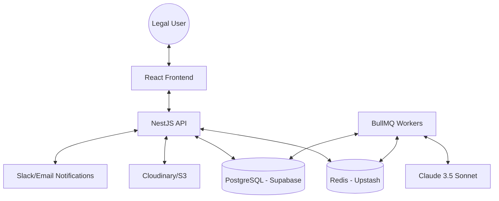

# ⚖️ LegalPulse

**LegalPulse** is an enterprise-grade, AI-powered legal operations platform designed to streamline document management, contract analysis, and matter tracking. It leverages Claude 3.5 Sonnet to provide human-level understanding of complex legal documents, enabling legal teams to work with unprecedented speed and accuracy.

## 🏗️ Architecture Overview



## 🌟 Key Features & Capabilities

### 1. Intelligent Contract Lifecycle
- **Automated Extraction**: Pulls 15+ critical data points (Effective Date, Termination, Liability Caps, Governing Law) from PDFs and DOCX files.
- **Confidence Scoring**: Every AI-extracted field includes a confidence score, highlighting items that require human verification.
- **Split-Pane Viewer**: Compare extracted terms side-by-side with the original document in a high-fidelity PDF viewer.

### 2. Proactive Risk Management
- **Smart Alerts**: Multi-channel notifications (Slack, Email, In-app) for upcoming expiration dates and auto-renewal deadlines.
- **Contract Health Dashboard**: High-level visualization of portfolio risk, expiring contracts, and pending reviews.

### 3. Matter & Collaboration
- **Centralized Matter Log**: Track litigation, IP filings, and corporate governance matters.
- **Role-Based Access Control (RBAC)**: Secure multi-tenant architecture ensuring data isolation between organizations.

### 4. Advanced Search & Retrieval
- **Semantic Search**: Use natural language to find clauses (e.g., "Find all contracts with 30-day termination for convenience").
- **Hybrid Search**: Combines traditional keyword matching with vector embeddings for 99% retrieval accuracy.

## 📁 Repository Structure

```bash
LegalPulse/
├── client/           # React 19 + Vite + Tailwind CSS 4
│   ├── src/pages/    # Dashboard, Contracts, Matters, Alerts, etc.
│   ├── src/layouts/  # Responsive dashboard layouts
│   └── src/lib/      # API clients and utility functions
├── server/           # NestJS + TypeORM + PostgreSQL
│   ├── src/modules/  # Feature modules (Contracts, Matters, Extraction, etc.)
│   ├── src/common/   # Shared services (AI, Storage, Mail, Slack)
│   └── test/         # E2E and Unit tests
└── docs/             # Technical specifications and SQL scripts
```

## 🚀 Quick Start Guide

### Prerequisites
- **Node.js**: v20+
- **Database**: PostgreSQL (Supabase recommended)
- **Cache**: Redis (Upstash recommended)
- **AI**: Anthropic API Key (Claude)

### Backend Setup
```bash
cd server
npm install
cp .env.example .env
# Update .env with your credentials
npm run start:dev
```

### Frontend Setup
```bash
cd client
npm install
cp .env.example .env
# Update .env with VITE_API_URL and VITE_CLERK_PUBLISHABLE_KEY
npm run dev
```

## 🛠️ Technology Stack

| Layer | Technologies |
| :--- | :--- |
| **Frontend** | React 19, Vite, Tailwind CSS 4, TanStack Query, Zustand, Lucide Icons |
| **Backend** | NestJS, TypeORM, PostgreSQL (Supabase), BullMQ, RxJS |
| **AI/ML** | Claude 3.5 Sonnet, OpenAI Embeddings, pgvector |
| **Services** | Clerk (Auth), Cloudinary (Storage), Resend (Email), Slack API |

## 📄 Documentation
- [MVP Build Specification](./legalpulse_mvp_spec.md)
- [Database Schema & Migrations](./supabase_setup.sql)


